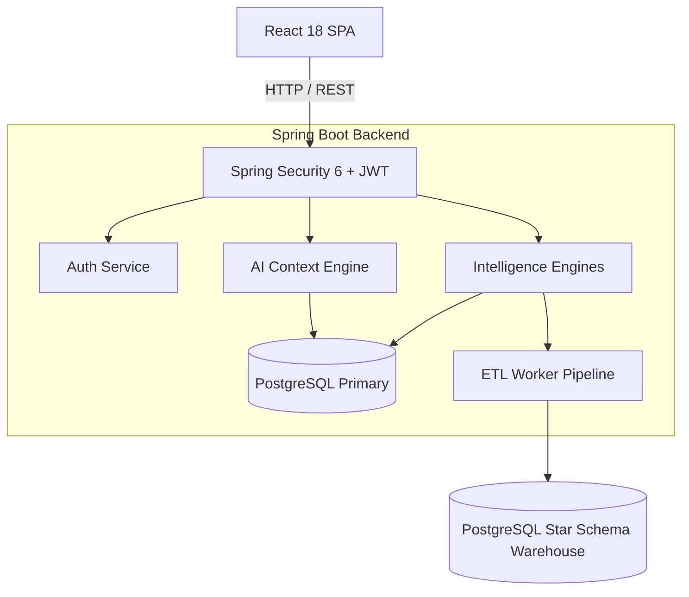

<div align="center">
  

  <h1>CareerOS AI</h1>
  <p><b>An open-source, AI-powered Career Operating System for engineering students.</b></p>

  <p>
    <a href="https://github.com/hindhusharajaram/CareerOS-AI/releases/tag/v1.0.0"></a>
    <a href="https://github.com/hindhusharajaram/CareerOS-AI/actions/workflows/backend-ci.yml"></a>
    <a href="https://github.com/hindhusharajaram/CareerOS-AI/actions/workflows/frontend-ci.yml"></a>
    <a href="https://java.com"></a>
    <a href="https://spring.io/projects/spring-boot"></a>
    <a href="https://react.dev"></a>
    <a href="https://www.typescriptlang.org"></a>
    <a href="https://www.postgresql.org"></a>
    <a href="https://www.docker.com"></a>
    <a href="LICENSE"></a>
  </p>
</div>

---

## 📌 What is CareerOS AI?

**CareerOS AI** is an open-source, AI-powered Career Operating System built specifically for computer science and engineering students preparing for competitive software engineering roles.

Rather than relying on static job portals or generic templates, CareerOS AI connects directly to a student's actual career profile — analyzing project portfolios, technical skills, coursework, and work experience to calculate an objective readiness score and generate personalized, actionable preparation roadmaps.

---

## 🎯 The 5 Pillars of Identity

CareerOS AI is designed around five core pillars of career intelligence:

| Pillar | Focus | Capability |
| :--- | :--- | :--- |
| 📊 **Assess** | **Career Readiness** | Calculates an objective, 9-factor weighted **Career Score (0–1000)** based on actual profile data. |
| 📄 **Analyze** | **ATS Compatibility** | Evaluates resumes against recruiter ATS patterns, keyword coverage, and quantifiable achievement density. |
| 🎯 **Recommend** | **Skill Gap Detection** | Identifies missing technologies and skills relative to target engineering job roles. |
| 🗺️ **Prepare** | **Structured Roadmaps** | Generates week-by-week 30, 60, and 90-day learning execution plans and mock interview prompts. |
| 📈 **Track** | **Analytics & Growth** | Tracks skill progression over time with a Star Schema data warehouse and ETL pipelines. |

---

## 🛠️ Architecture & Technology Stack

CareerOS AI is built with modern, production-tested software engineering standards:

- **Backend**: Java 21 LTS, Spring Boot 3.4, Spring Security (Stateless JWT + Rate Limiting), Spring Data JPA, Apache Tika.
- **Frontend**: React 18, TypeScript 5.7, Vite 6, TailwindCSS 3, Recharts, Lucide Icons.
- **Database**: PostgreSQL 17 (Relational Store + Star Schema Data Warehouse).
- **DevOps**: Docker, Docker Compose, GitHub Actions CI/CD.



---

## 🚀 Quick Start (Local Setup)

The quickest way to launch CareerOS AI locally is using **Docker Compose**:

```bash
# 1. Clone the repository
git clone https://github.com/hindhusharajaram/CareerOS-AI.git
cd CareerOS-AI

# 2. Start all containers (PostgreSQL, Backend API, Frontend UI)
docker-compose up --build -d

# 3. Access the application
# Frontend UI: http://localhost:5173 (or http://localhost)
# Backend API: http://localhost:8080/api/v1/version
# Health Check: http://localhost:8080/api/v1/observability/health
```

### Manual Development Setup

If you prefer running services directly:

1. **Database**: Ensure PostgreSQL 17 is running on `localhost:5432` with database `careeros_ai_db`.
2. **Backend**:
   ```bash
   cd backend
   mvn spring-boot:run
   ```
3. **Frontend**:
   ```bash
   cd frontend
   npm install
   npm run dev
   ```

---

## 📸 Screenshots

| Page / Interface | Preview |
| :--- | :--- |
| **Landing Page** |  |
| **Student Dashboard** |  |
| **Career Score Engine** |  |
| **AI Career Chat** |  |
| **Analytics & Data Warehouse** |  |

---

## 📚 Detailed Documentation

For technical deep dives, architectural specs, and deployment guides, explore the `docs/` directory:

- 🏗️ [System Architecture](docs/architecture/ARCHITECTURE.md)
- 🔐 [Spring Security & Auth Design](docs/architecture/spring_security_architecture.md)
- 🚀 [Deployment Guide](docs/deployment/DEPLOYMENT_GUIDE.md)
- 🧪 [Testing Strategy](docs/testing/TESTING_STRATEGY.md)
- 📋 [Disaster Recovery Plan](docs/Disaster_Recovery_Plan.md)
- 📝 [Sprint Notes & Walkthroughs](docs/sprint-notes/)

---

## 🤝 Contributing & Community

We welcome open-source contributions from engineering students and software developers!

- 📖 [Contributing Guidelines](CONTRIBUTING.md)
- 🛡️ [Security Policy](SECURITY.md)
- 📜 [Code of Conduct](CODE_OF_CONDUCT.md)
- 🗺️ [Project Roadmap](ROADMAP.md)

---

## 📄 License

CareerOS AI is licensed under the [MIT License](LICENSE).