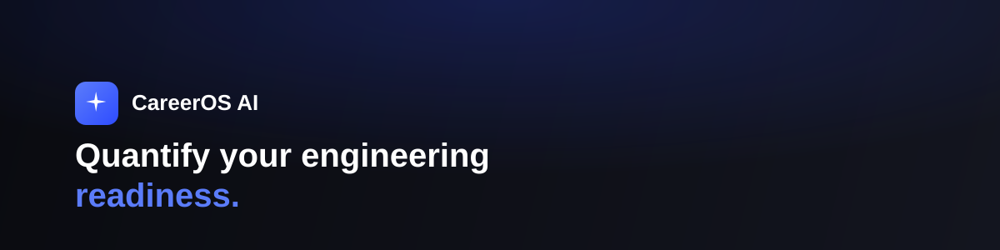
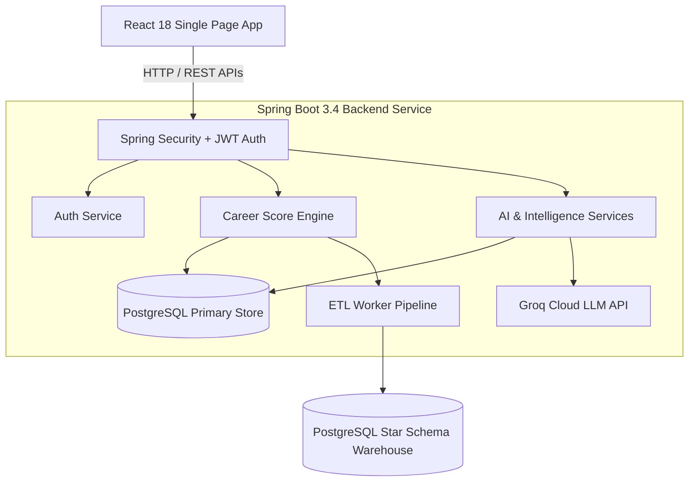
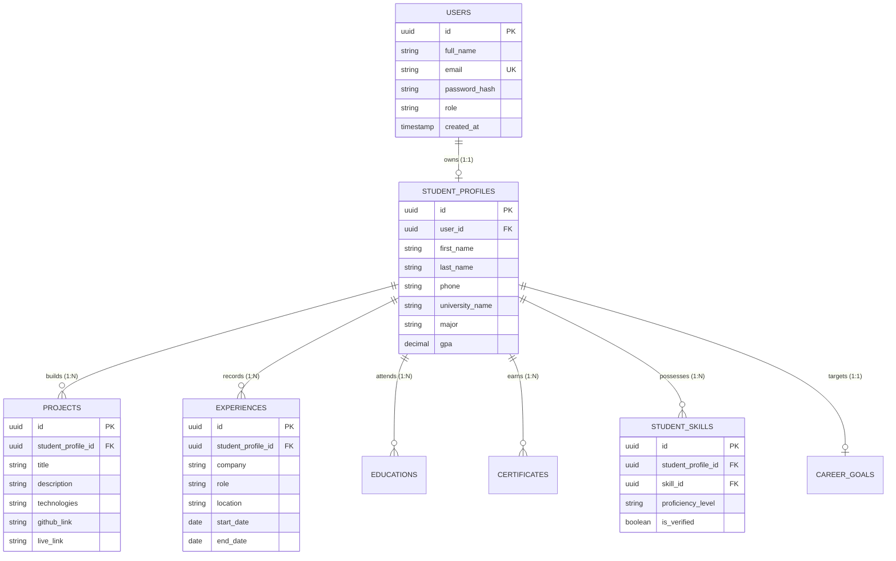

<div align="center">
  

  <h1>CareerOS AI</h1>
  <p><b>An AI-powered career readiness platform for engineering students — built with Spring Boot, React, and PostgreSQL.</b></p>

  <p>
    <a href="https://career-os-ai-mu.vercel.app"></a>
    <a href="docs/demo/CareerOS_AI_OnePager.pdf"></a>
  </p>

  <p>
    <a href="https://github.com/hindhusharajaram/CareerOS-AI/releases/tag/v1.0.0"></a>
    <a href="https://github.com/hindhusharajaram/CareerOS-AI/actions/workflows/backend-ci.yml"></a>
    <a href="https://github.com/hindhusharajaram/CareerOS-AI/actions/workflows/frontend-ci.yml"></a>
    <a href="https://java.com"></a>
    <a href="https://spring.io/projects/spring-boot"></a>
    <a href="https://react.dev"></a>
    <a href="https://www.typescriptlang.org"></a>
    <a href="https://www.postgresql.org"></a>
    <a href="LICENSE"></a>
  </p>
</div>

---

> **Maintainer Note (Hindhusha P R):** CareerOS AI is an open-source project designed to turn messy, subjective career preparation into an objective, data-driven workflow. If you spot bugs or want to help improve the intelligence scoring engines, issue reports and pull requests are always welcome.

---

## Table of Contents
- [Overview](#-overview)
- [Live Demo](#-live-demo)
- [Self-Assessment vs CareerOS AI](#-manual-self-assessment-vs-careeros-ai)
- [Core Features](#-core-features)
- [Architecture & Technology Stack](#-architecture--technology-stack)
- [Database Schema (JPA Entities)](#-database-schema-jpa-entities)
- [Quick Start](#-quick-start-local-setup)
- [Documentation](#-documentation)
- [Contributing & Community](#-contributing--community)
- [License](#-license)

---

## 📌 Overview

Most engineering students struggle to evaluate whether their projects, skills, and resumes meet industry standards before applying for software engineering roles. They rely on generic resume advice, static job portals, and unquantified self-evaluations.

**CareerOS AI** bridges this gap by connecting directly to a student's actual profile data — analyzing project portfolios, technical skill matrices, coursework, and work experience. It calculates an objective **Career Score (0–1000)** and generates grounded, step-by-step preparation roadmaps.

---

## 🎥 Live Demo

- **Live Web Application:** [career-os-ai-mu.vercel.app](https://career-os-ai-mu.vercel.app)
- **One-Pager Overview:** [docs/demo/CareerOS_AI_OnePager.pdf](docs/demo/CareerOS_AI_OnePager.pdf) — single-page PDF summary.

> *Note: The live application is hosted on free-tier infrastructure (Vercel & Render) and may take up to 60 seconds to respond on initial load after a period of inactivity (cold start).*

---

## ⚖️ Manual Self-Assessment vs CareerOS AI

| Dimension | Manual Self-Assessment | CareerOS AI Engine |
| :--- | :--- | :--- |
| **Readiness Metric** | Unquantified guessing / subjective confidence | Objective **Career Score (0–1000)** calculated across 9 weighted profile categories |
| **Resume Evaluation** | Manual formatting checks and guesswork | Automated ATS parser evaluation against keyword density and section completeness |
| **Skill Gap Analysis** | Vague awareness of missing tools | Targeted skill gap matrix comparing profile skills against target role requirements |
| **Action Plan** | Random tutorial watching | Week-by-week 30, 60, and 90-day structured preparation roadmaps |
| **Project Audit** | Unchecked code quality | Grounded Project Advisor AI auditing architecture, security, and Docker configurations |

---

## 🚀 Core Features

- **Career Score Engine (0–1000 Scale)**: Weighted calculation across 9 profile areas: Profile Completeness (150 pts), Projects (200 pts), Skills Matrix (200 pts), Experience (150 pts), Education (100 pts), Certificates (100 pts), Resume Quality (50 pts), GitHub (30 pts), and LinkedIn (20 pts).
- **ATS Resume Review**: Resume text parsing with Apache Tika and PDFBox fallback to evaluate section completeness, contact details, and ATS keyword density.
- **Search-Driven AI Project Advisor**: Search-first project architecture engine powered by Groq Cloud AI (`llama-3.3-70b-versatile` / `openai/gpt-oss-120b`), providing file-level citations (`Source: application.properties`, `Source: Dockerfile`) and interactive follow-up Q&A.
- **Skill Gap & Roadmap Engines**: Identifies missing technical skills relative to desired engineering roles and builds structured 30/60/90-day study schedules.
- **AI Workspace Suite**: Interactive AI modules (Career Copilot, AI Career Chat, Resume Review, Learning Coach, Mock Interview, Project Advisor).
- **Data Engineering & Analytics**: Event-driven analytics platform with Star Schema data warehouse and ETL pipelines tracking profile growth.

---

## 🛠️ Architecture & Technology Stack

CareerOS AI uses a decoupled client-server architecture with Spring Boot 3.4 REST APIs and a React 18 single-page application.

| Layer | Technologies & Libraries |
| :--- | :--- |
| **Backend Framework** | Java 21 LTS, Spring Boot 3.4.2, Spring Data JPA, Hibernate, Maven |
| **Security & Auth** | Spring Security 6 (Stateless JWT tokens), Role-Based Access Control (`ROLE_STUDENT`, `ROLE_COMPANY`, `ROLE_ADMIN`) |
| **AI & NLP Engine** | Groq Cloud API (`llama-3.3-70b-versatile`, `openai/gpt-oss-120b`), Apache Tika 2.9, PDFBox 3.0 |
| **Frontend Framework** | React 18, TypeScript 5.7, Vite 6, TailwindCSS 3, Recharts, Lucide Icons |
| **Database & Persistence** | PostgreSQL 17 (Primary Relational Store + Star Schema Data Warehouse), HikariCP Connection Pooling |
| **DevOps & Infrastructure** | Docker, Docker Compose, GitHub Actions CI/CD workflows, Vercel & Render hosting |



---

## 🗄️ Database Schema (JPA Entities)

The primary relational store manages users, student profiles, and career artifacts:



---

## 🚀 Quick Start (Local Setup)

### Option A: Launching via Docker Compose

```bash
# 1. Clone the repository
git clone https://github.com/hindhusharajaram/CareerOS-AI.git
cd CareerOS-AI

# 2. Start PostgreSQL, Backend API, and Frontend UI
docker-compose up --build -d

# 3. Access local endpoints
# Frontend Application: http://localhost:5173
# Backend REST API:    http://localhost:8080/api/v1/health
```

### Option B: Manual Local Development

#### Prerequisites
- **Java 21 LTS** & **Apache Maven 3.9+**
- **Node.js 18+** & **npm 10+**
- **PostgreSQL 17** running on `localhost:5432` with database `careeros_ai_db`

#### 1. Backend Setup
```bash
cd backend
mvn clean spring-boot:run
```
*The backend API starts on `http://localhost:8080`.*

#### 2. Frontend Setup
```bash
cd frontend
npm install
npm run dev
```
*The Vite frontend dev server starts on `http://localhost:5173`.*

---

## 📚 Documentation

Detailed technical design documents and guides are available in the `docs/` directory:

- 🏗️ [System Architecture](docs/architecture/ARCHITECTURE.md)
- 🔐 [Spring Security & Auth Design](docs/architecture/spring_security_architecture.md)
- 🚀 [Deployment Guide](docs/deployment/DEPLOYMENT_GUIDE.md)
- 🧪 [Testing Strategy](docs/testing/TESTING_STRATEGY.md)
- 📋 [Disaster Recovery Plan](docs/Disaster_Recovery_Plan.md)
- 📝 [Sprint Notes & Walkthroughs](docs/sprint-notes/)

---

## 🤝 Contributing & Community

Contributions are welcome! Please review the repository guidelines before submitting pull requests:

- 📖 [Contributing Guidelines](CONTRIBUTING.md)
- 🛡️ [Security Policy](SECURITY.md)
- 📜 [Code of Conduct](CODE_OF_CONDUCT.md)
- 🗺️ [Project Roadmap](ROADMAP.md)

---

## 📄 License

Distributed under the MIT License. See [LICENSE](LICENSE) for details.