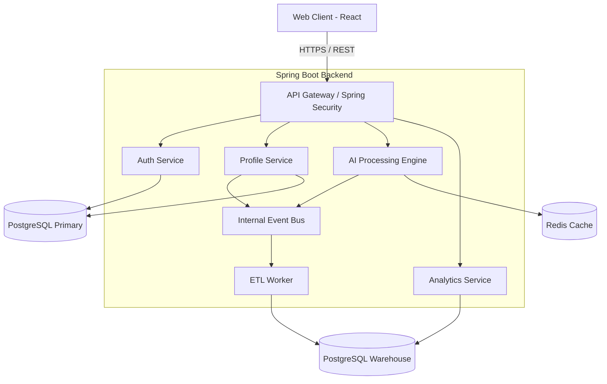
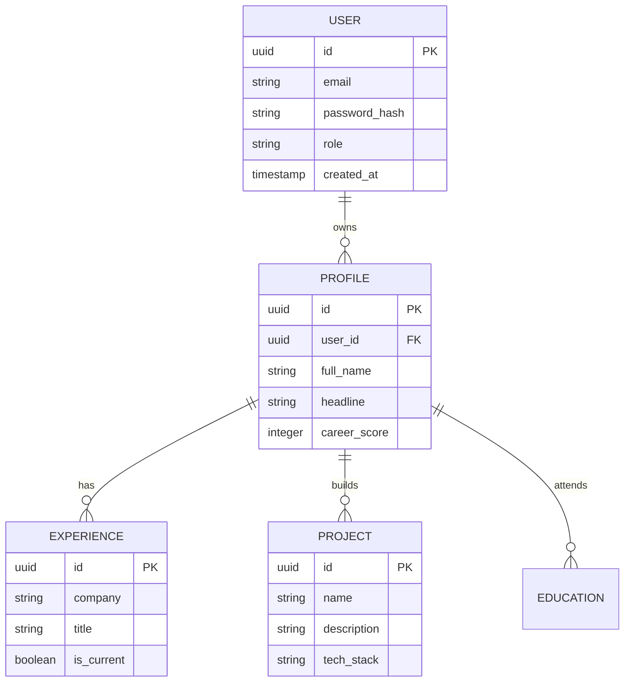

<div align="center">
  
  
  <h1>CareerOS AI</h1>
  <p><b>The Next-Generation Intelligent Career Acceleration Platform</b></p>

  <p>
    
    
    
    
    
    
    
    
  </p>
</div>

---

## 📖 Project Overview

**CareerOS AI** is an enterprise-grade, AI-powered career acceleration platform designed to bridge the gap between students, educators, and recruiters. By leveraging artificial intelligence, data analytics, and modern software architecture, CareerOS AI provides actionable insights, automated resume parsing, mock interviews, and career trajectory mapping.

### The Problem
Students often lack data-driven feedback on their resumes and career readiness. Traditional university career portals are static, manual, and unengaging.

### The Solution
A highly interactive, dynamic, and intelligent platform that acts as a 24/7 personal career coach, analyzing profiles against industry standards and providing concrete, actionable recommendations.

---

## ✨ Key Features

### 🧠 Intelligence & AI
- **AI Resume Parser**: Automatically extracts entities, skills, and experiences from uploaded resumes.
- **Career Score Engine**: Proprietary algorithm generating a holistic placement readiness score (0-100).
- **Smart Recommendations**: Context-aware suggestions for skill gaps and project improvements.

### 📊 Data & Analytics
- **Data Warehouse**: Dedicated ETL pipelines streaming events into a structured analytics warehouse.
- **Admin Dashboard**: Real-time observability of system health, active users, and global career metrics.
- **Trend Analytics**: Visual graphs mapping skill demands and profile improvements over time.

### 🔐 Security & Architecture
- **Role-Based Access Control (RBAC)**: Secure separation between Student and Admin boundaries.
- **Stateless JWT Auth**: High-performance, scalable authentication mechanism.
- **Enterprise Observability**: Prometheus metrics, structured logging, and distributed tracing readiness.

---

## 🛠️ Tech Stack

| Domain | Technology | Description |
| :--- | :--- | :--- |
| **Backend** | Java 21, Spring Boot 3 | High-performance core API architecture |
| **Frontend** | React 18, Vite, TypeScript | Lightning-fast, premium UI with TailwindCSS |
| **Database** | PostgreSQL, Flyway | Relational data persistence and schema migrations |
| **Caching** | Redis | High-speed data caching and session management |
| **DevOps** | Docker, Docker Compose | Containerized deployments and local environments |
| **CI/CD** | GitHub Actions | Automated build, test, and release pipelines |

---

## 🏗️ Architecture

### System Architecture



### Entity Relationship Diagram (ERD)



---

## 📁 Folder Structure

```text
CareerOS-AI/
├── backend/                  # Spring Boot Application
│   ├── src/main/java/        # Java Source Code
│   │   ├── config/           # Security & App Configurations
│   │   ├── controller/       # REST API Endpoints
│   │   ├── service/          # Business Logic & AI Engines
│   │   ├── repository/       # Data Access Layer
│   │   ├── model/            # JPA Entities & DTOs
│   │   └── observability/    # Metrics & Tracing
│   └── src/main/resources/   # Application properties & Flyway
├── frontend/                 # React + Vite Application
│   ├── src/
│   │   ├── components/       # Reusable UI (Cards, Buttons, Charts)
│   │   ├── pages/            # Page Views (Dashboard, Analytics)
│   │   ├── services/         # API Integration & Axios clients
│   │   └── utils/            # Helper functions
├── assets/                   # README graphics and diagrams
├── docker-compose.yml        # Local infrastructure orchestration
└── README.md
```

---

## 🚀 Getting Started

### Prerequisites
- Docker & Docker Compose
- Node.js 20+
- Java 21

### Local Development Setup

1. **Clone the repository**
   ```bash
   git clone https://github.com/your-username/CareerOS-AI.git
   cd CareerOS-AI
   ```

2. **Spin up Infrastructure (Database & Cache)**
   ```bash
   docker-compose up -d
   ```

3. **Run the Backend**
   ```bash
   cd backend
   ./gradlew bootRun
   ```

4. **Run the Frontend**
   ```bash
   cd frontend
   npm install
   npm run dev
   ```

5. **Access the Application**
   Open your browser and navigate to `http://localhost:5173`.

---

## 🐳 Docker Deployment

To run the entire application stack in containers for a production-like environment:

```bash
docker-compose -f docker-compose.prod.yml up --build -d
```

---

## 🗺️ Roadmap & Documentation

- [Project Roadmap](ROADMAP.md) - View completed milestones and future enhancements.
- [Contributing Guidelines](CONTRIBUTING.md) - Learn how to contribute to CareerOS AI.
- [Security Policy](SECURITY.md) - Information on reporting vulnerabilities.
- [Code of Conduct](CODE_OF_CONDUCT.md) - Our community standards.

---

## 👨‍💻 Author

**Hindhusha P.R.**  
*Software Engineer & Architect*

---

## 📄 License

This project is licensed under the MIT License - see the [LICENSE](LICENSE) file for details.