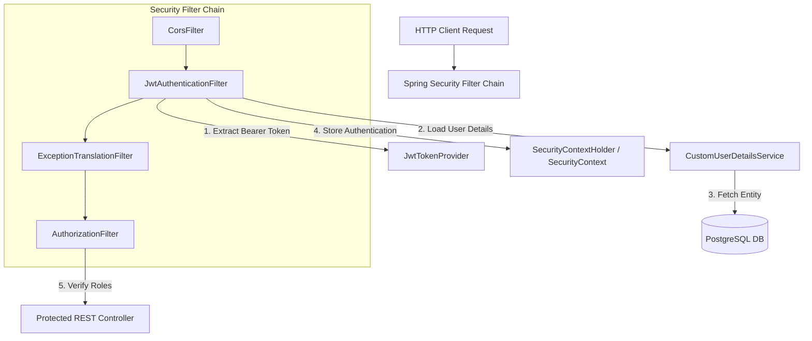
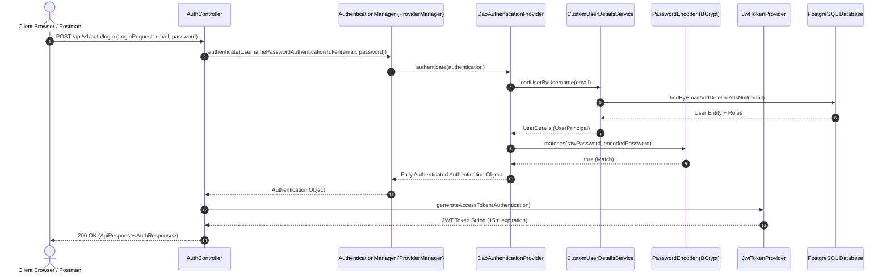
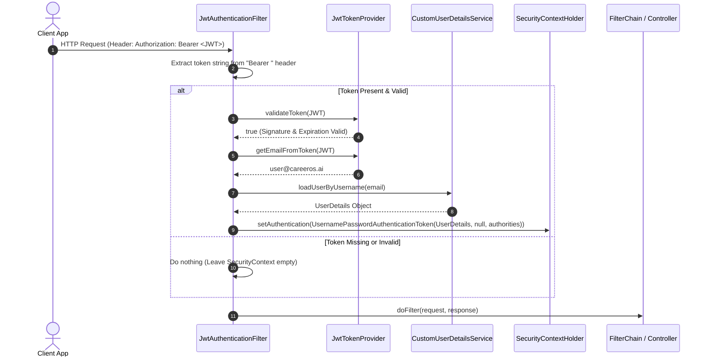
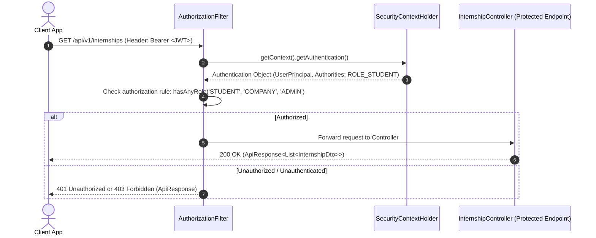

# Spring Security & JWT Architecture Deep-Dive — CareerOS AI

## 1. Spring Security Core Architectural Components

CareerOS AI implements a stateless, token-based security architecture built on Spring Security 6+ and Spring Boot 3.4.x.

### Component Breakdown & Responsibilities

1. **`SecurityContextHolder`**:
   - The central repository storing details of the currently authenticated principal in the application context via `ThreadLocal` storage.
2. **`SecurityContext`**:
   - Holds the `Authentication` object associated with the current request thread.
3. **`Authentication`**:
   - Represents the authenticated user identity, principal (`UserDetails`), credentials (erased after authentication), and granted authorities (`GrantedAuthority` list: `ROLE_STUDENT`, `ROLE_COMPANY`, `ROLE_ADMIN`).
4. **`AuthenticationManager`**:
   - The primary API interface resolving authentication requests. Defaults to `ProviderManager`.
5. **`AuthenticationProvider` (`DaoAuthenticationProvider`)**:
   - Performs password validation by calling `UserDetailsService` to fetch user details and `PasswordEncoder` to compare BCrypt hashes.
6. **`UserDetailsService` (`CustomUserDetailsService`)**:
   - Custom domain bridge loading database `User` entities by email and converting them to Spring Security `UserDetails` objects.
7. **`PasswordEncoder` (`BCryptPasswordEncoder`)**:
   - Hashes passwords using BCrypt with strength 10.
8. **`JwtTokenProvider`**:
   - Generates, parses, signs, and validates HMAC-SHA256 JJWT tokens.
9. **`JwtAuthenticationFilter`**:
   - `OncePerRequestFilter` intercepting incoming HTTP requests, extracting the `Authorization: Bearer <token>` header, validating token validity, and populating `SecurityContextHolder`.

---

## 2. Sequence Diagrams

### 2.1 Login Authentication Lifecycle

### 2.2 JWT Request Validation Lifecycle

### 2.3 Protected Endpoint Access Lifecycle

---

## 3. Sprint 1.3 Micro-Sprint Implementation Strategy

Following this architectural review (Sprint 1.3A):
- **Sprint 1.3B**: Implement `JwtTokenProvider` (standalone JJWT 0.12.6 token generation & validation engine).
- **Sprint 1.3C**: Implement `CustomUserDetailsService` & `JwtAuthenticationFilter`.
- **Sprint 1.3D**: Implement `SecurityConfig` (PasswordEncoder bean, AuthManager bean, FilterChain setup, CORS).
