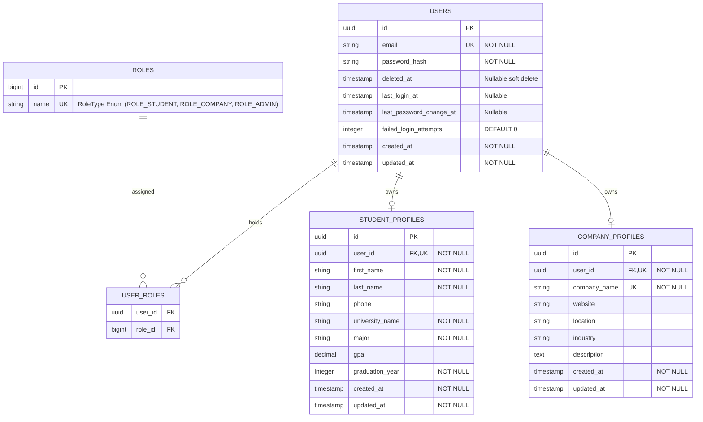
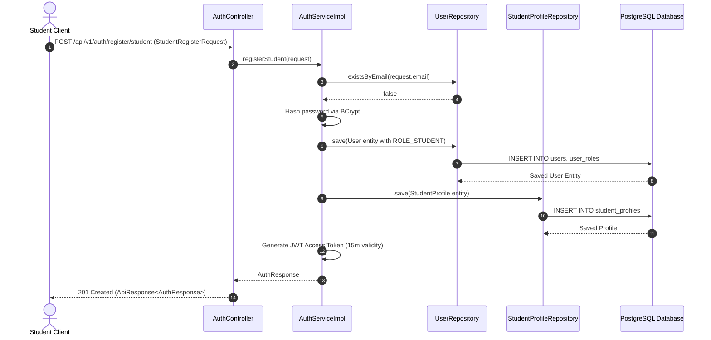
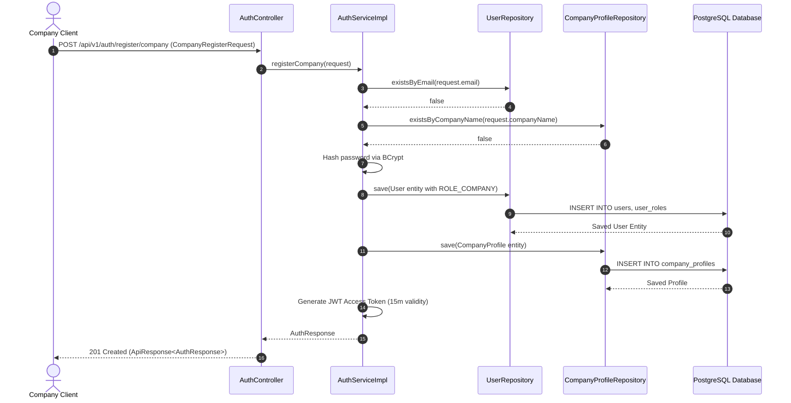
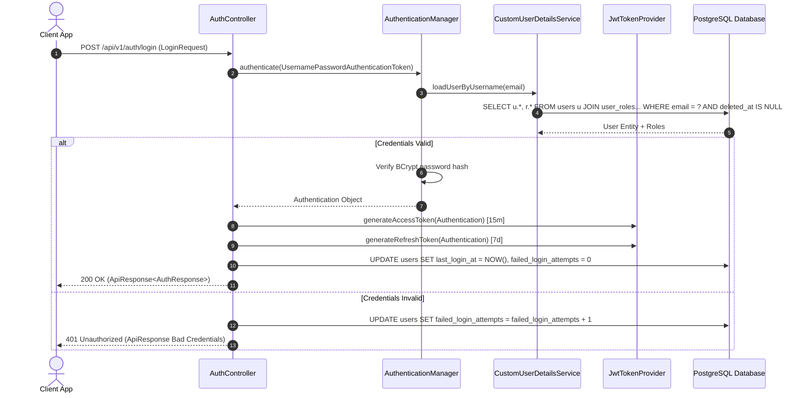
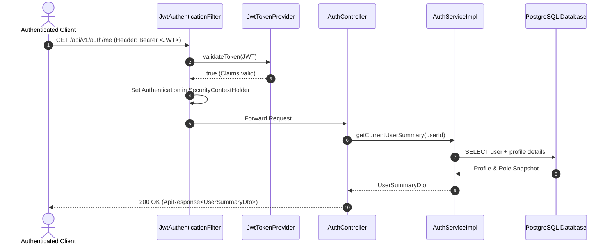
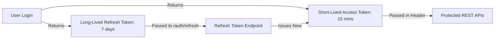

# Sprint 1A Architecture & Domain Design Document: Authentication & Authorization (Refined)

## 1. Executive Summary & Functional Requirements

The Authentication & Access Control system forms the security perimeter for CareerOS AI. It provides identity management, dual-token stateless authentication, role-based access control (RBAC), and user profile provisioning for three primary user personas: **Student**, **Company Representative**, and **Administrator**.

### Functional Requirements
1. **User Registration**:
   - **Student Registration**: Register with email, password, first name, last name, university name, major, and graduation year.
   - **Company Registration**: Register with email, password, company name, website, location, and industry.
2. **User Login & Dual-Token Strategy**:
   - Authenticate credentials (email + password) using BCrypt password hashing.
   - Return a short-lived signed JWT Access Token (15-minute validity) and provision for long-lived Refresh Tokens (7-day validity).
3. **Role-Based Access Control (RBAC)**:
   - Enforce system roles: `ROLE_STUDENT`, `ROLE_COMPANY`, `ROLE_ADMIN` via N:M join table (`user_roles`).
   - Protect REST API endpoints based on role authorizations.
4. **Current User Profile Retrieval**:
   - Authenticated `/api/v1/auth/me` endpoint to retrieve active user identity, assigned roles, and profile snapshot.
5. **Soft Deletion & Security Auditing**:
   - Support soft deletion via nullable `deleted_at` timestamp.
   - Track security metrics: `last_login_at`, `last_password_change_at`, and `failed_login_attempts`.

---

## 2. Password Complexity & Validation Rules

All user passwords must strictly satisfy enterprise complexity requirements:
- **Length**: Minimum 8 characters, Maximum 64 characters.
- **Character Diversity Requirements**:
  - At least 1 uppercase letter (`[A-Z]`)
  - At least 1 lowercase letter (`[a-z]`)
  - At least 1 numerical digit (`[0-9]`)
  - At least 1 special character (`[!@#$%^&*(),.?":{}|<>]`)
- **Jakarta Validation Regex Pattern**:
  `^(?=.*[a-z])(?=.*[A-Z])(?=.*\d)(?=.*[!@#$%^&*(),.?":{}|<>])[A-Za-z\d!@#$%^&*(),.?":{}<>]{8,64}$`

---

## 3. Refined Domain Model & Database Schema

### Entity Relationship Diagram (ERD)

---

## 4. Sequence Diagrams

### 4.1 Student Registration Flow

### 4.2 Company Registration Flow

### 4.3 User Login Flow

### 4.4 Get Current User (`/me`) Flow

---

## 5. Token Lifecycle Architecture & Dual-Token Strategy

- **Access Token**:
  - Lifetime: 15 minutes.
  - Storage: In-memory (React AuthContext state).
  - Purpose: Authorization header for API requests.
- **Refresh Token Architecture (Future Ready)**:
  - Lifetime: 7 days.
  - Storage: HTTP-Only Secure Cookie.
  - Token Rotation: Single-use rotation strategy (invalidates previous refresh token upon renewal).

---

## 6. Future-State Architecture Specifications

### 6.1 Email Verification Flow
- **Workflow**: Upon registration, user account is marked `email_verified = false`. An asynchronous token (`email_verification_tokens` table) with a 24-hour expiration link is generated and sent via SMTP/SendGrid.
- **Verification Endpoint**: `GET /api/v1/auth/verify-email?token=...` updates status to `email_verified = true`.

### 6.2 Account Lockout Strategy
- **Threshold**: Maximum 5 consecutive failed login attempts (`failed_login_attempts >= 5`).
- **Lock Action**: Sets `account_locked_until = NOW() + 15 minutes`.
- **Reset**: Successful authentication resets `failed_login_attempts` to 0.
